# Una proposta aperta di riorganizzazione delle linee urbane di trasporto pubblico a L'Aquila

*Ultimo aggiornamento: 8 ottobre 2026 — [Storia e versioni del documento](#appendice-storia-e-versioni-del-documento)  — [licenza CC BY-SA 4.0.](https://github.com/gabricurciaq/proposta-linee-ama-laquila/blob/main/README.md)*

## Sintesi infografica

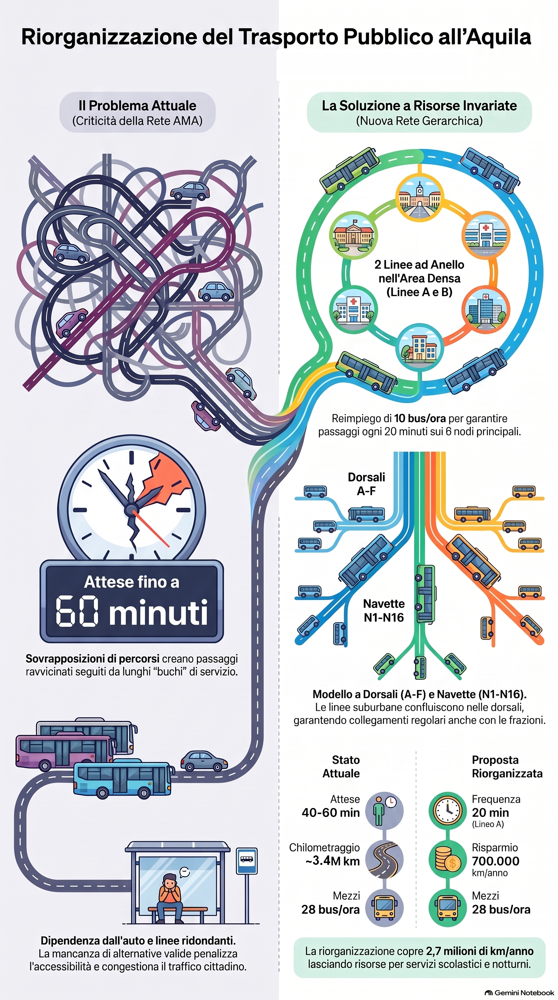

## Video illustrativi della proposta

| Proposta aperta trasporto pubblico all'Aquila - Teaser | [YouTube](https://www.youtube.com/watch?v=qRjJGyypHos&list=PLAtZhKhpyfQ8&index=6) | [Facebook]() | [Instagram]() |
|---|---|---|---|
| 1. Le nuove linee AMA a L'Aquila: siamo di fronte a una svolta? | [YouTube](https://www.youtube.com/watch?v=SN5JXWVQsdI&list=PLAtZhKhpyfQ8&index=1) | [Facebook](https://www.facebook.com/reel/1618319656581449) | [Instagram](https://www.instagram.com/reel/Ddvpfz1IdKB/?utm_source=ig_web_copy_link&stkn=MzRlODBiNWFlZA==) |
| 2. Come funziona il trasporto pubblico all'Aquila? | [YouTube](https://www.youtube.com/watch?v=pKselmY0huY&list=PLAtZhKhpyfQ8&index=2) | [Facebook](https://www.facebook.com/reel/1170681555292171) | [Instagram](https://www.instagram.com/reel/Dd60sVaIB8E/?utm_source=ig_web_copy_link&stkn=MzRlODBiNWFlZA==) |
| 3. Come possiamo migliorare il trasporto pubblico all'Aquila? | [YouTube](https://www.youtube.com/watch?v=EgGQcHm9Gzc&list=PLAtZhKhpyfQ8&index=3) | [Facebook](https://www.facebook.com/reel/1569806674441346) | [Instagram](https://www.instagram.com/reel/DeCHkMoo_lx/?utm_source=ig_web_copy_link&stkn=MzRlODBiNWFlZA==) |
| 4. Come migliorare il servizio bus per le frazioni? | [YouTube](https://www.youtube.com/watch?v=oKms6LGx8OA&list=PLAtZhKhpyfQ8&index=4) | [Facebook](https://www.facebook.com/reel/958106780700201) | [Instagram](https://www.instagram.com/reel/DeNBa2bIyVV/?utm_source=ig_web_copy_link&stkn=MzRlODBiNWFlZA==) |
| 5. Come gestire il trasporto scolastico? | [YouTube](https://www.youtube.com/watch?v=xeLKZKqAguk&list=PLAtZhKhpyfQ8&index=6) | [Facebook](https://www.facebook.com/reel/1641976400898644) | [Instagram](https://www.instagram.com/reels/DeQ4axvIxc6/) |

[Scarica le slide mostrate nei video](media/video_slides.pdf)

## Indice

- [Scopo e documenti di riferimento](#scopo-e-documenti-di-riferimento)
- [Trasporto pubblico](#trasporto-pubblico)
  - [Area urbana densa (linee AMA attuali 1, 2, 3, A/B)](#area-urbana-densa-linee-ama-attuali-1-2-3-ab)
    - [Distribuzione della densità della popolazione all’Aquila](#distribuzione-della-densità-della-popolazione-allaquila)
    - [Stato attuale e principali problematiche](#stato-attuale-e-principali-problematiche)
    - [Proposta di riorganizzazione](#proposta-di-riorganizzazione)
  - [Collegamento con le frazioni](#collegamento-con-le-frazioni)
    - [Torretta e Gignano (linee AMA attuali 5-M5)](#torretta-e-gignano-linee-ama-attuali-5-m5)
    - [S. Giacomo, Collebrincioni, Aragno (linee AMA attuali 8 e 9)](#s-giacomo-collebrincioni-aragno-linee-ama-attuali-8-e-9)
    - [S. Elia, Paganica, Assergi (linee AMA attuali 6S/D, M6, 7)](#s-elia-paganica-assergi-linee-ama-attuali-6sd-m6-7)
    - [Bagno, Ocre, Monticchio, Picenze (linee AMA attuali 10, 16, 16A)](#bagno-ocre-monticchio-picenze-linee-ama-attuali-10-16-16a)
    - [Pianola, Roio (linee AMA attuali 11, 11A)](#pianola-roio-linee-ama-attuali-11-11a)
    - [Sassa (linee AMA attuali 12, 12A)](#sassa-linee-ama-attuali-12-12a)
    - [Coppito, Preturo, Arischia (linee AMA attuali 13, 13A, 14D, 15)](#coppito-preturo-arischia-linee-ama-attuali-13-13a-14d-15)
  - [Navette](#navette)
    - [Centro storico (linee AMA attuali CENTRO, 17, 18)](#centro-storico-linee-ama-attuali-centro-17-18)
    - [Polo industriale-commerciale Campo di Pile (linea AMA attuale 19)](#polo-industriale-commerciale-campo-di-pile-linea-ama-attuale-19)
  - [Bus notturni](#bus-notturni)
  - [Trasporto scolastico e universitario](#trasporto-scolastico-e-universitario)
  - [Nomenclatura e informazioni su linee e servizio in tempo reale](#nomenclatura-e-informazioni-su-linee-e-servizio-in-tempo-reale)
- [Conclusioni](#conclusioni)
  - [Riepilogo e stima conteggio chilometrico della proposta](#riepilogo-e-stima-conteggio-chilometrico-della-proposta)
  - [Sviluppi futuri](#sviluppi-futuri)
- [Appendice: Storia e versioni del documento](#appendice-storia-e-versioni-del-documento)

---

## Scopo e documenti di riferimento

Il presente documento è frutto di varie fasi di studio, riflessione,
discussione e sintesi da parte di cittadini per lo più aggregati in
diverse realtà associative del territorio, come brevemente riportato in
Appendice.

La motivazione alla base del suo sviluppo è la crescente e condivisa
esigenza di intraprendere un salto di qualità rispetto allo stato
attuale in tema di viabilità e mobilità della città dell’Aquila,
riguardo, ad esempio, l’accesso al centro storico per residenti e
visitatori, la congestione del traffico urbano, i servizi di trasporto
per studenti scolastici e universitari, trasporto per i lavoratori, la
scarsa attenzione alla pedonalità e alla ciclabilità nel tessuto urbano.

La base del ragionamento muove dal riconoscere che l’evoluzione sia
della viabilità che della mobilità urbana dall’ultimo dopoguerra è stata
fortemente influenzata e, per certi versi, asservita all’utilizzo
dell’automobile privata. Questo ha penalizzato le altre modalità di
trasporto urbano, ovvero la pedonalità, il trasporto pubblico, la
ciclabilità e la loro connessione multimodale e ha condizionato in modo
determinate lo sviluppo stesso del quadro urbanistico complessivo.

Ci si trova di conseguenza oggi a non avere reali alternative all’uso
del veicolo privato, con un sistema che presenta il conto, oltre che con
i suoi vantaggi, anche con tutti i suoi limiti: l’esclusione delle fasce
più deboli (bambini, persone con disabilità, redditi bassi, ecc.), la
congestione del traffico, la richiesta sproporzionata e impraticabile di
spazio pubblico (vedasi ad esempio la questione dei parcheggi al
servizio del centro storico), la scarsa efficienza energetica (bassa
densità di passeggeri per veicolo).

Il superamento di questi limiti non può che passare attraverso una
revisione della filosofia di fondo con cui si gestisce lo spazio
pubblico stradale (viabilità) e il modo con cui ci si muove attraverso
esso (mobilità), rendendo il sistema più vario, flessibile e accessibile
per tutti, in particolare superando la dipendenza esclusiva dall’uso
dell’automobile privata e rendendo efficaci anche altre soluzioni di
trasporto sostenibili e multimodali. Ciò porterebbe a diffusi vantaggi
economici, gestionali e sociali ben oltre il mero spostarsi in città.

Nello sviluppare le idee riportate in questo documento, lungi dal
pretendere di sostituirsi alla progettazione tecnica dei singoli
interventi, si è tenuta presente al meglio la pianificazione comunale in
tema di viabilità e mobilità:

- Il Piano Urbano per la Mobilità Sostenibile (PUMS)[^1]

- Il Piano Generale del Traffico Urbano (PGTU)[^2]

- Progetto Metrobus[^3]

- Il Biciplan[^4]

- Del. G. C. 597 del 30.11.2023 contente progetto PNRR finanziato
  “Estensione della rete ciclabile di collegamento tra la stazione
  ferroviaria dell’Aquila e le sedi universitarie urbane”

- Il Piano Urbano della Logistica Sostenibile (PULS)[^5]

Nell’auspicio di contribuire al miglioramento della qualità della vita
della città dell’Aquila, si resta a piena disposizione per chiarimenti e
interazioni riguardo la presente proposta.

## Trasporto pubblico

La proposta di riorganizzazione delle linee dell’Azienda per la Mobilità
Aquilana (AMA)[^6] mira a un uso più flessibile e ampio del servizio di
trasporto, **utilizzando in modo più razionale le risorse (economiche,
di personale e di mezzi) <u>attualmente</u> in dotazione all’AMA**. Se
realizzata, la riorganizzazione proposta permetterebbe una **transizione
rapida a un sistema più facilmente utilizzabile da un maggior numero di
utenti** rispetto allo stato attuale, in attesa della realizzazione di
progetti in essere come il **Metrobus** e ciò che è previsto
nell’attuazione del Piano Urbano della Mobilità Sostenibile (PUMS),
adottato nel 2022 dal Comune dell’Aquila.

###  Area urbana densa (linee AMA attuali 1, 2, 3, A/B)

#### Distribuzione della densità della popolazione all’Aquila

Il punto di partenza per immaginare soluzioni nuove per il trasporto
pubblico è comprendere a grandi linee la forma della città, perché la
rete di trasporto pubblico dipende primariamente da come si distribuisce
la popolazione. La mappa della densità abitativa del comune dell'Aquila
(Figura 1) e dei comuni limitrofi mostra un'area centrale molto densa,
con 4.000-5.000 abitanti per km², circondata da una rete di frazioni e
centri minori. Qui le densità scendono sotto i 1.000 abitanti per km².

<!--
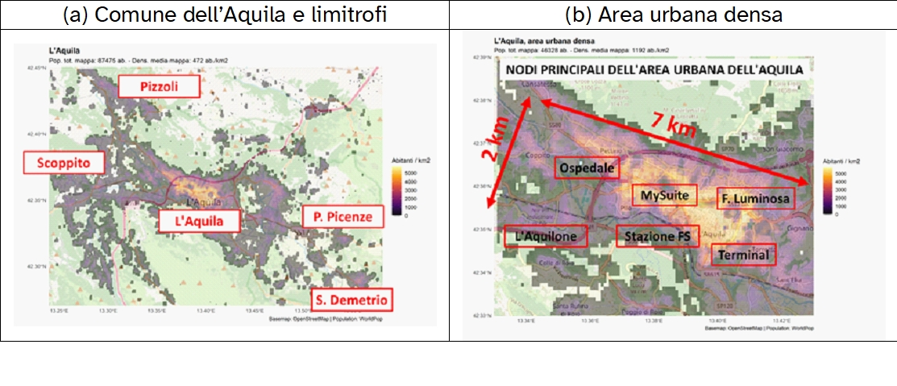
-->

| \(a\) Comune dell'Aquila e limitrofi | \(b\) Area urbana densa |
|---|---|
| 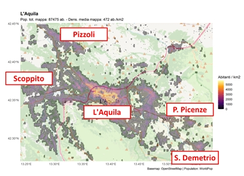 | 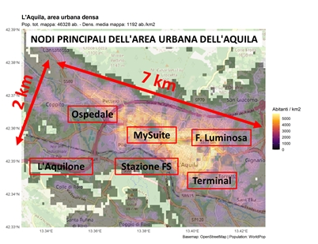 |

Figura 1. Distribuzione della densità di popolazione nel Comune
dell’Aquila. (a) L’Aquila e comuni limitrofi, (b) area urbana densa.

Restringendo l'attenzione all'area più densa, tra il centro e la zona
ovest con i quartieri più popolosi, si individua una fascia lunga circa
7 km e larga circa 2 km, che segue l'asse della valle. Lungo questa
fascia ci sono sei nodi fondamentali, importanti sia per la città sia
per il trasporto pubblico:

- **Terminal** bus Collemaggio: linee bus urbane ed extraurbane

- **Fontana Luminosa**: approdo preferenziale per accesso pedonale al
  centro storico, Polo universitario centro

- **MySuite**: linee bus urbane ed extraurbane

- **Ospedale/Polo universitario Coppito**

- Centro commerciale **L’Aquilone**: numerosi esercizi commerciali e
  aziende medio-grandi (es. poli farmaceutico e spaziale)

- **Stazione FS** centrale

Questa struttura si riflette sugli spostamenti. Secondo i dati del PUMS
(Piano Urbano della Mobilità Sostenibile) del 2022, più della metà degli
spostamenti riguarda l'area interna (Figura 2). Di questi, circa il 72%
resta all'interno della parte più densa. Circa il 20% è scambio con le
frazioni e circa il 10% è diretto fuori comune, verso i comuni
limitrofi. Questo indica dove si concentra la domanda e dove si dispone
naturalmente la rete già oggi.

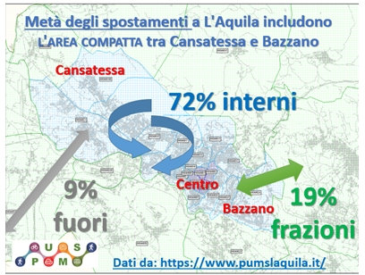

Figura 2. Distribuzione percentuale degli spostamenti incentrati
sull’area urbana densa del Comune dell’Aquila (dati PUMS, 2022).

#### Stato attuale e principali problematiche

L’organizzazione delle linee AMA, a seguito dei cambiamenti introdotti
dall’azienda il 16 settembre 2026, che servono la zona centro-ovest
della città (**linee 1, 2, 3, A/B**) è utile a raccogliere utenza nella
parte più densamente popolata compresa tra il centro storico e i
quartieri di Torrione, Valle Pretara, S. Sisto, S. Barbara, Pettino e
Cansatessa e a collegare tra di loro i sei nodi principali, riportati
per comodità in Figura 3.

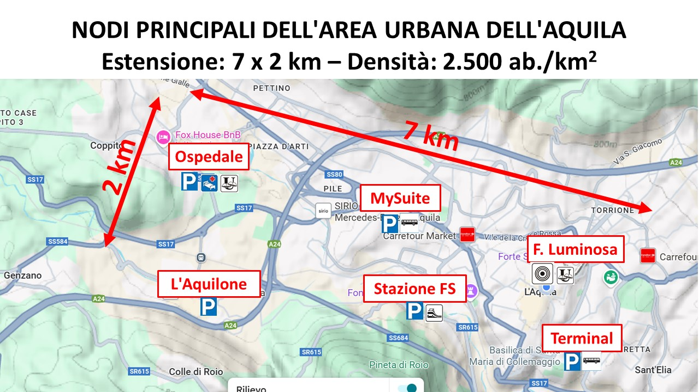

Figura 3. Principali nodi dell’area urbana più densamente abitata del
Comune dell’Aquila. L’area copre la zona centro-ovest della valle, ha
un’estensione di circa 7 km in lunghezza e 2 km in larghezza, con una
densità abitativa media di circa 2.500 abitanti per chilometro quadrato.

Le **linee attuali** sono schematicamente riportate in Figura 4. Tali
linee seguono, su percorsi diversi, le tratte che uniscono ai capi il
Terminal di Collemaggio e la zona ovest facente capo all’Ospedale o
all’Aquilone. La frequenza dei passaggi per ogni direzione è compresa
tra 40 e 60 minuti a seconda della linea, anche se tale **frequenza non
è regolare nel tempo e presenta speso sovrapposizione su percorsi
vicini, creando alternativamente a volte concentrazione in pochi minuti
di passaggi simili, a volte “buchi” di 40-50 minuti in una certa zona**.
La frequenza è all’incirca dimezzata al sabato e nel periodo estivo non
scolastico.

L’eccezione è rappresentata dalle **navette A/B** che percorrono un
anello che unisce Terminal, Fontana Luminosa, MySuite, Ospedale e
Stazione FS, l’una in senso orario, l’altra in senso antiorario a
frequenza regolare di 50 minuti dal lunedì al sabato tutto l’anno. Pur
con una frequenza ancora troppo bassa, la logica di quest’ultima linea
appare quella più utilizzabile, proprio perché cadenzata e con un
percorso fisso che unisce diversi punti nodali in modo facilmente
comprensibile.

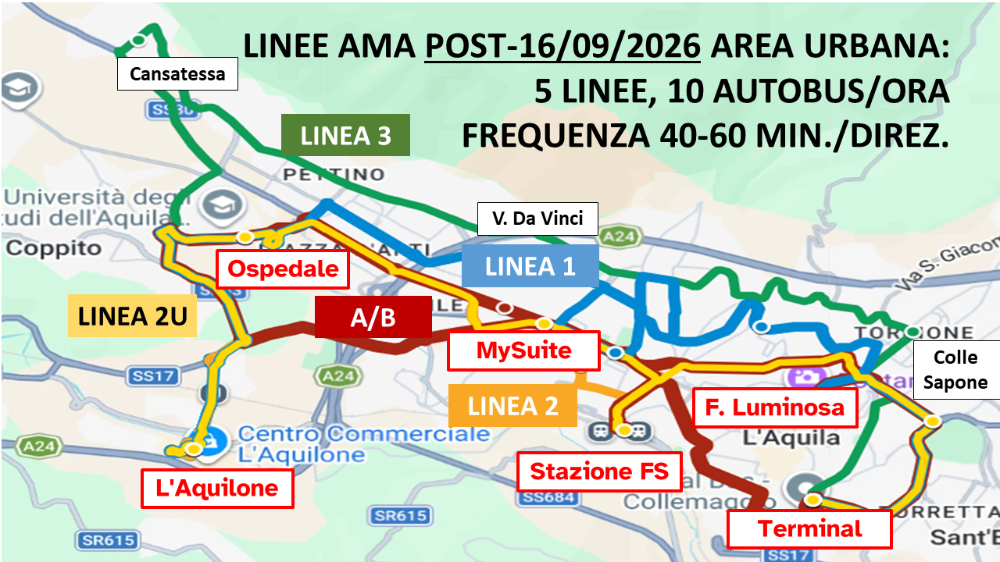

Figura 4. Mappa delle attuali linee AMA che servono la parte più
centrale e densamente popolata dell’Aquila. La frequenza dei passaggi è
compresa tra 40 e 60 minuti, che va a dimezzarsi al sabato e nel periodo
estivo non scolastico. Queste linee impiegano 10 autobus l’ora.

La principale problematica legata a questa impostazione è la
**irregolarità e scarsità della** **frequenza di passaggio e la
difficoltà ad individuare la fermata più conveniente** in un dato
momento del giorno. L’origine della problematica è legata alla
ridondanza di linee che fanno percorsi ridondanti con le altre linee,
per di più a orari discontinui e su percorsi parziali, come ad esempio
le corse 1T/ e 2U, che appaiono come una complicazione poco utile e
molto dispendiosa. Questo impedisce un uso flessibile del servizio,
quando gli orari non sono perfettamente programmabili, quindi quasi
sempre, se non per usi molto specifici come l’entrata e uscita
scuolastica.

#### Proposta di riorganizzazione

Da un conto approssimativo considerando i due sensi di marcia le linee
1, 2, 3, A/B impiegano almeno 10 autobus l’ora. La proposta è quella di
utilizzare questi 10 autobus al fine di servire in modo più frequente le
stesse zone attualmente percorse dalle linee, ma modificandone la logica
prendendo spunto ed **eliminando le ridondanze inefficienti ed**
**estendendo a tutta l’area il concetto delle navette A/B**.

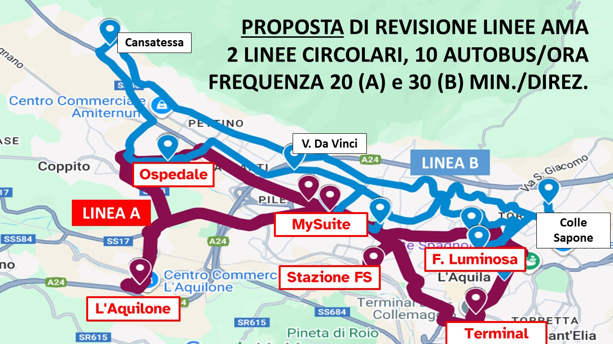

Figura 5. Proposta di revisione delle linee AMA principali,
riorganizzando su due linee ad anello da percorrere in senso orario e
antiorario i 10 autobus/ora attualmente impiegati per le linee 1, 2, 3,
navette A/B. La frequenza di passaggio sarebbe di 20 minuti per ogni
senso di marcia sulla linea A (6 autobus) e di 30 minuti sulla linea B
(4 autobus).

Si propone, in particolare, di semplificare l’organizzazione nelle
**<u>due sole linee ad anello</u>** riportate in Figura 5, denominate
con le lettere A e B, sia per distinguerle dalle attuali sia per
conferire un senso di **rete metropolitana**. Tutte queste linee
andrebbero **percorse contemporaneamente in senso orario e antiorario,**
come avviene oggi per le navette A/B.

La **LINEA A** sarebbe un’estensione delle attuali navette A/B che
congiungerebbe i **sei nodi principali della rete**, percorrendo un
“otto” che arriva fino all’Aquilone. Questa linea è concepita per essere
a frequenza regolare di non più di **20 minuti per direzione di marcia e
costituire il “metronomo” di tutte le altre**, che andrebbero a
collegarsi a questa in uno o più nodi principali. Il percorso
approssimativo è di circa 20 km, quindi percorribili in circa 60 minuti
per ogni senso di marcia. Per avere una frequenza di 20 minuti per senso
di marcia, verrebbero impiegati **6 autobus**, che percorrerebbero così
120 km/ora in totale. Ci sarebbe quindi un passaggio ogni 10 minuti
nelle due direzioni ad ogni fermata, facendo partire gli autobus in
direzioni opposte con uno sfasamento di 10 minuti. Il percorso in senso
antiorario sarebbe: Terminal Collemaggio – Via Strinella – Fontana
Luminosa – Viale Croce Rossa – MySuite – Ospedale – L’Aquilone – MySuite
(da S.S. 17) – Stazione FS – via XX Settembre – Terminal Collemaggio. Il
bus in senso orario farebbe lo stesso percorso in senso inverso, sfasato
con l’altro di 10 minuti.

La **LINEA B** andrebbe a coprire la fascia nord dell’insediamento
abitativo più denso, con una frequenza di passaggio di 30 minuti per
ciascun senso di marcia, sulla falsa riga delle attuali linee 3 e 4 e in
parte della 1. Essa si collegherebbe ai nodi della linea A alla Fontana
Luminosa e all’Ospedale, a breve distanza anche al MySuite. Passerebbe
per i quartieri del Torrione, S. Francesco, Valle Pretara, S. Sisto, S.
Barbara, Via Antica Arischia, Pettino, Cansatessa, Ospedale/Università
Coppito, Via Comunità Europea/Da Vinci/Amiternum. La lunghezza del
percorso ipotizzato di circa 25 km, percorribile in un’ora o poco più.
Con i quattro autobus dedicati, sempre circolanti nei due sensi di
rotazione, si potrebbe garantire una frequenza di circa 30 minuti per
senso di marcia, ovvero un passaggio ogni 15 minuti in ogni coppia di
fermate nelle due direzioni. Si andrebbero così a percorrere 100 km/ora
in totale.

Questa proposta avrebbe quindi i seguenti **vantaggi a parità di numero
di mezzi** e chilometraggio orario impiegati:

- Regolarizza e **abbassa a 20 minuti per senso di marcia la frequenza
  di passaggio su un percorso che unisce tutti i nodi principali** e di
  interscambio dell’area urbana densa (LINEA A);

- Attraversa in modo frequente (15 minuti per senso di marcia) molte vie
  **densamente popolate** e quindi con una utenza potenziale maggiore
  come Via Strinella, Via XX Settembre, il Torrione, ecc.;

- Unisce in modo frequente e regolare i **nodi extraurbani MySuite e
  Stazione** sia col centro storico che con l’Ospedale/Polo
  universitario Coppito, favorendo in generale **l’intermodalità**;

- Rende i passaggi in tutte le zone coperte **più facilmente
  comprensibili e a intervalli orari regolari**.

- Tutte le altre linee attuali dalla 5 in poi, che servono le **frazioni
  e i quartieri più periferici, andrebbero a confluire per il cambio con
  la LINEA A** ad alta frequenza nel nodo più vicino. Ad esempio, quelle
  provenienti da Ovest all’Ospedale o L’Aquilone, quelle da Est alla
  Fontana Luminosa o al Terminal di Collemaggio, quelle da Sud alla
  Stazione FS, quelle da Nord al MySuite o Fontana Luminosa. In questo
  modo, oltre a collegarsi in modo omogeneo e flessibile a tutta la
  parte centrale della città, **risparmiando chilometri acquisirebbero
  una frequenza di servizio maggiore**.

### Collegamento con le frazioni

#### Torretta e Gignano (linee AMA attuali 5-M5)

Come si evince dalla mappa del percorso riportato in Figura 6, la linea
collega il Terminal di Collemaggio con i quartieri di Torretta e
Gignano, transitando anche Via della Polveriera. Ci sono 15 corse
giornaliere tra le 6:55 e le 21:00 nei giorni scolastici, 11 in quelli
non scolastici, con maggiore concentrazione del servizio negli orari di
entrata e uscita delle scuole. Ci sono infatti anche due corse speciali
che transitano per Colle Sapone alle 7:30 (M5W) e alle 13:15 (M5Y). Il
percorso ciclico viene effettuato in 35 minuti circa.

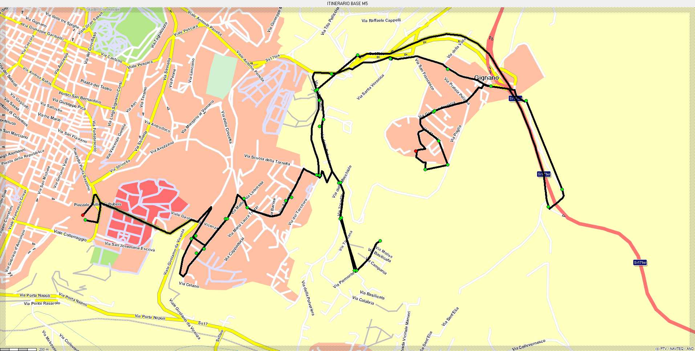

Figura 6. Percorso dell’attuale linee AMA 5 e M5, indicato con la linea
nera. In giallo le principali strade.

La linea è concepita come un collegamento specifico tra centro storico e
due quartieri molto prossimi, tale da configurarsi più come un
**servizio di tipo navetta**. Per diventare davvero tale, tuttavia,
avrebbe bisogno di essere **aumentato considerevolmente di frequenza**,
in modo da poter essere utilizzato dagli abitanti delle aree
attraversate per spostarsi nell’area e verso il centro in modo agevole e
intercettare le altre linee principali del trasporto urbano per compiere
tragitti a più ampio raggio. Per incoraggiare l’uso per l’accesso al
centro, sarebbe ideale avere la fermata anche alla **Fontana Luminosa**,
anzi si potrebbe sostituire il tragitto verso il Terminal con quello
verso la Fontana Luminosa, rendendo il percorso un circuito chiuso e
includendo anche **Piazzale Cencioni**, che non verrebbe più
attraversato dalla linea principale, che passerebbe per Via Strinella.

La linea potrebbe essere elencata tra le Navette, con **numerazione N5 e
portata a frequenza di 30 minuti costante durante il giorno, coordinati
al passaggio della linea A** alla Fontana Luminosa. L’idea sarebbe
quella di trasformare la linea in una navetta che colleghi in modo
circolare Fontana Luminosa, parcheggio ex Caserma Rossi, Piazzale
Cencioni, Torretta, Gignano e Colle Sapone (Figura 7). Il **verso di
percorrenza potrebbe essere alternato nei due sensi** a ogni passaggio
alla Fontana Luminosa.

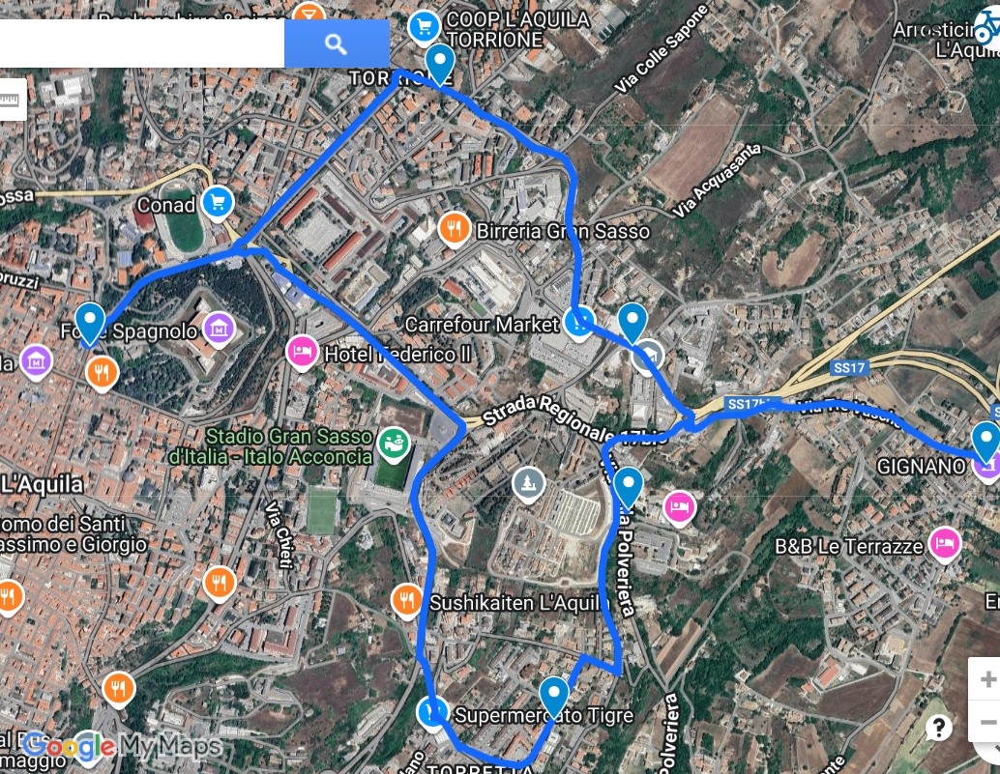

Figura 7. Idea progettuale per una navetta N5 che collega in modo
circolare Fontana Luminosa, Piazzale Cencioni e i quartieri di Torretta,
Gignano e Colle Sapone.

#### S. Giacomo, Collebrincioni, Aragno (linee AMA attuali 8 e 9)

L’attuale linea 8 collega il Terminal di Collemaggio con la frazione di
S. Giacomo con 9 corse giornaliere, transitando anche per la Fontana
Luminosa. L’attuale linea 9 collega similmente il Terminal con le
frazioni di Collebrincioni e Aragno.

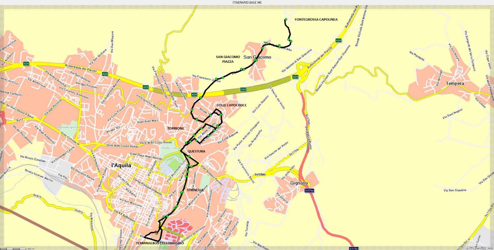

Figura 8. Percorso dell’attuale linea AMA M8, indicato con la linea
nera. In giallo le principali strade.

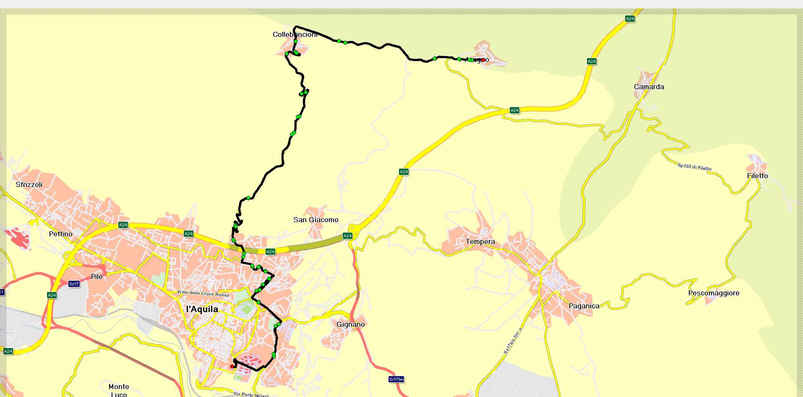

Figura 9. Percorso dell’attuale linea AMA 9/M9, indicato con la linea
nera. In giallo le principali strade.

Queste due linee, che di fatto sono già delle navette locali, potrebbero
essere incrementate di frequenza facendo da **spola solo con la Fontana
Luminosa**, dove è possibile intersecare le linee A e B. Il loro
passaggio offrirebbe anche un **collegamento in più**, oltre a quello
della linea B, tra la **popolosa e densa zona del Torrione e il centro
storico**. Il servizio potrebbe essere effettuato con una navetta N8,
che colleghi la Fontana Luminosa alternativamente con S. Giacomo e
Collebrincioni-Aragno (Figura 10).

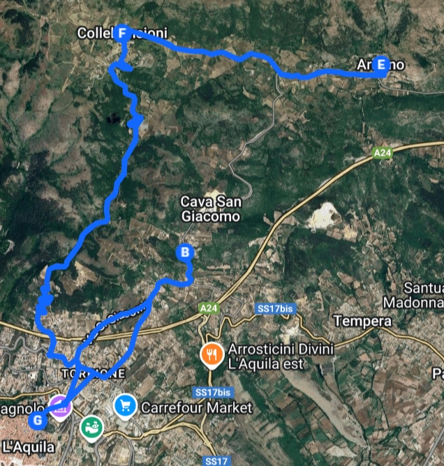

Figura 10. Idea progettuale della navetta N8, che collega la Fontana
Luminosa, dove avviene l’innesto con le linee A e B, alternativamente
con S. Giacomo e Collebrincioni-Aragno, transitando per il Torrione.

#### S. Elia, Paganica, Assergi (linee AMA attuali 6S/D, M6, 7)

Il quadrante Nord-Est comprende le frazioni di S. Elia, Paganica,
Camarda, Filetto, Pescomaggiore, Assergi.

L’attuale linea 6S/D (Figura 11) collega S. Elia e Paganica al Terminal
di Collemaggio, per poi proseguire fino all’Aquilone su un percorso
simile a quello dell’attuale linea 1. Effettua circa 35 corse
giornaliere per senso di marcia (S o D) nei giorni scolastici, anche se
non tutte sul percorso completo.

La linea M6 (Figura 12) collega il Terminal con Fonte Cerreto, per
accedere anche alla Funivia del Gran Sasso (8 corse al giorno). La linea
M6B (Figura 13) è una circolare che collega Paganica con il nucleo
industriale-commerciale di Bazzano-Paganica (4 corse al giorno). La
linea 7 (Figura 14) è collega Paganica con le vicine frazioni di
Camarda, Filetto e Pescomaggiore, per poi arrivare al Terminal di
Collemaggio (6 corse al giorno).

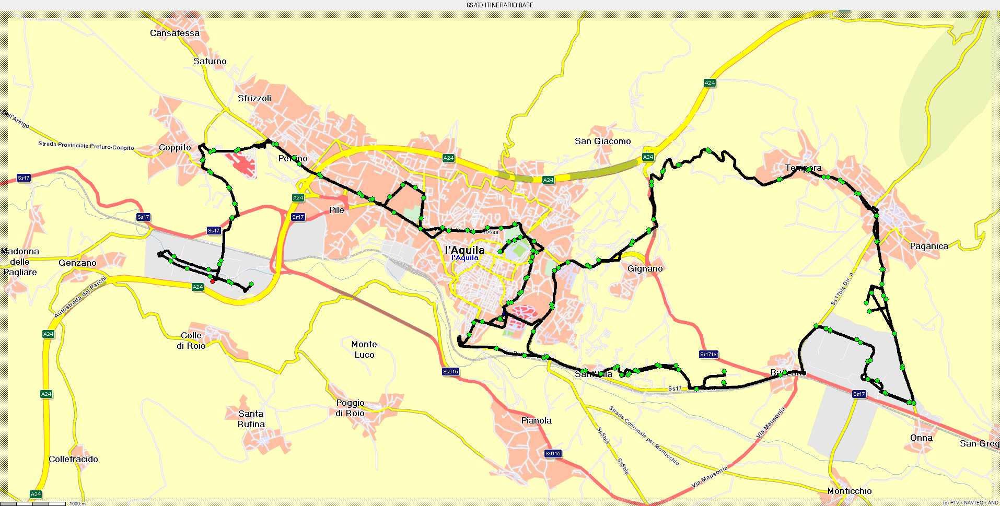

Figura 11. Percorso dell’attuale linee AMA 6S/D, indicato con la linea
nera. In giallo le principali strade.

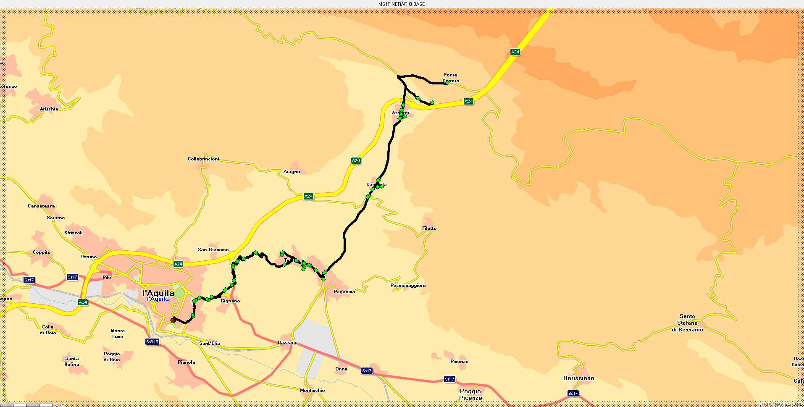

Figura 12. Percorso dell’attuale linea AMA M6, indicato con la linea
nera. In giallo le principali strade.

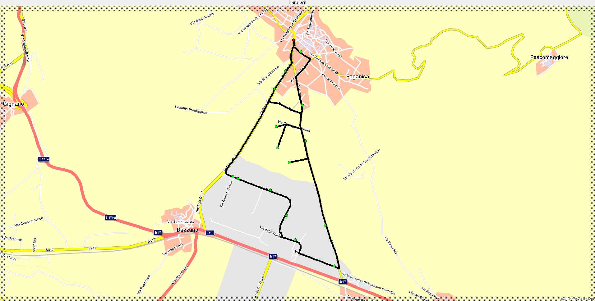

Figura 13. Percorso dell’attuale linea AMA M6B, indicato con la linea
nera. In giallo le principali strade.

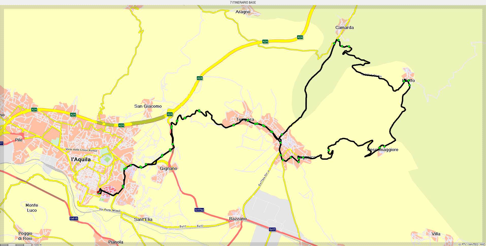

Figura 14. Percorso dell’attuale linea AMA 7, indicato con la linea
nera. In giallo le principali strade.

La frazione di Paganica emerge chiaramente come il fulcro su cui è
imperniata la mobilità del quadrante Nord-Est dell’area suburbana.
Alcune delle corse attuali sono già concepite per avere un nodo di
interscambio proprio a Paganica o comunque sul percorso della linea
principale 6S/D.

Sembra possibile ottimizzare il servizio **rendendo più frequente la
linea 6**, mantenendone la circolarità a doppio senso di percorrenza, ma
fermando le corse per l’interscambio con la linea A proposta o altre
linee al Terminal di Collemaggio. La linea potrebbe essere
**rinominata** **linea C** (Figura 15), a formare la terza in ordine
gerarchico nel tessuto urbano e transitando anche per il **nodo
ferroviario di Paganica**, suscettibile di sviluppi futuri con un
servizio metropolitano ferroviario tra l’area ovest e l’area est
dell’Aquila. Inoltre, la linea potrebbe transitare in **Via della
Polveriera** anziché salire per il Viale di Collemaggio che è
disabitato.

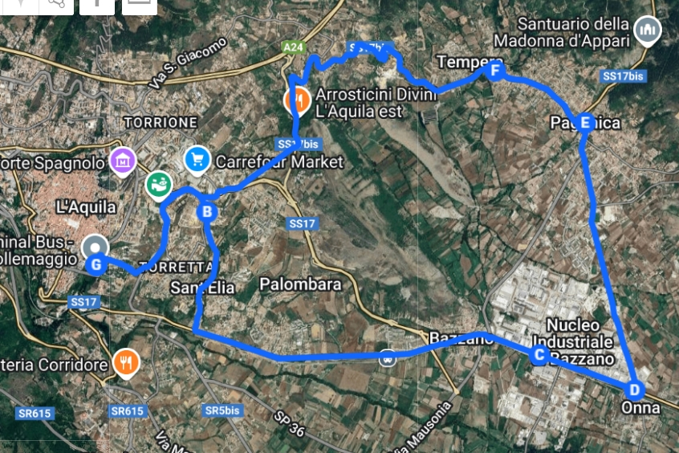

Figura 15. Idea progettuale della nuova linea C, dorsale a doppio senso
di percorrenza del quadrante suburbano Nord-Est.

Le altre linee diverrebbero tutte delle **navette che si diramano da
Paganica**. Quella per **Fonte Cerreto diverrebbe** **N6** (Figura 16),
la circolare **Paganica-Camarda-Filetto-Pescomaggiore la N7** (Figura
17), mentre quella del nucleo industriale di Bazzano-Paganica potrebbe
essere rivalutata alla luce della sua reale funzione e considerata la
parziale sovrapposizione con la linea C. In quel contesto, potrebbe
essere attivata una navetta locale a chiamata per compiere piccoli
spostamenti.

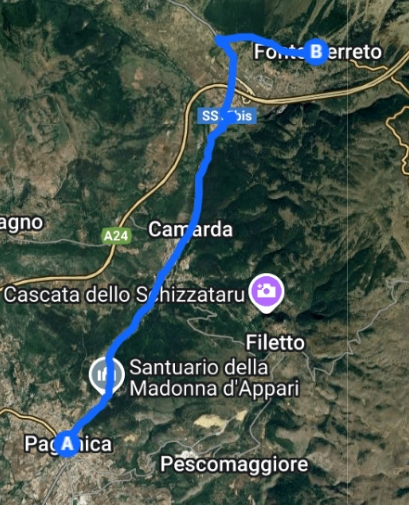

Figura 16. Idea progettuale della navetta N6, che si innesta a Paganica
nella linea C e che collega quest’ultima a Fonte Cerreto per la Funivia
del Gran Sasso.

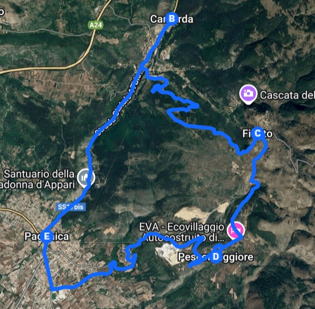

Figura 17. Idea progettuale della navetta N7, che si innesta a Paganica
nella linea C e che collega quest’ultima a alle frazioni di Camarda,
Filetto e Pescomaggiore.

#### Bagno, Ocre, Monticchio, Picenze (linee AMA attuali 10, 16, 16A)

Il quadrante Sud-Est comprende le frazioni di Bagno, Ocre, Monticchio,
S. Gregorio, Fossa, Picenze.

La linea 10 (Figura 18) collega il Terminal di Collemaggio con Bagno e
sue frazioni con circa 15 corse circolari giornaliere. La linea 16
collega il Terminal con Civita di Bagno, Cavalletto d’Ocre Monticchio,
Fossa con 15 corse A/R al giorno. La linea 16A (Figura 19) collega il
Terminal con S. Gregorio e Picenze con circa 12 corse giornaliere A/R.

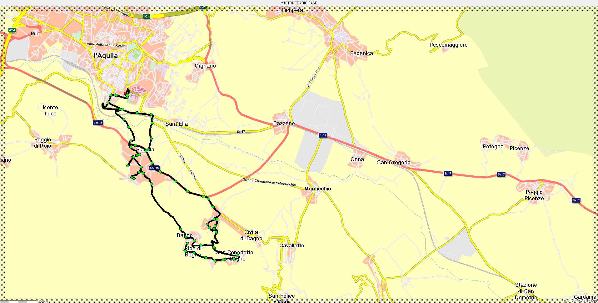

Figura 18. Percorso dell’attuale linea AMA 10, indicato con la linea
nera. In giallo le principali strade.

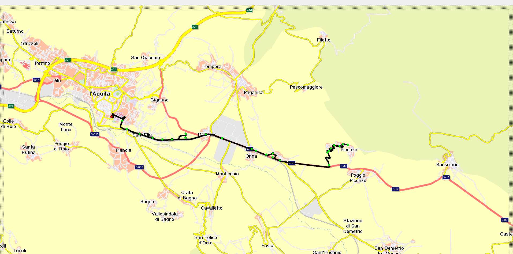

Figura 19. Percorso dell’attuale linea AMA 16A, indicato con la linea
nera. In giallo le principali strade.

Anche in questo caso, appare più razionale istituire una circolare
principale e delle navette che servano le frazioni limitrofe a zone. In
particolare, si potrebbe istituire una **linea D** circolare a doppio
senso di percorrenza (Figura 20), che colleghi il Terminal di
Collemaggio a Civita Di Bagno, Monticchio, Stazione di Paganica, S.
Elia.

A questa dorsale del quadrante Sud-Est dell’area suburbana, si
andrebbero ad agganciare quelle che diverrebbero **navette N10 e N16**
per servire le località rispettivamente di Bagno e di S. Gregorio,
Fossa, Picenze. La N10 si coordinerebbe con la linea D a Civita di
Bagno, servendo alternativamente Bagno e Ocre (Figura 21). La N16 si
innesterebbe con le linee C e D alla stazione di Paganica, servendo
alternativamente Fossa e Picenze (Figura 22).

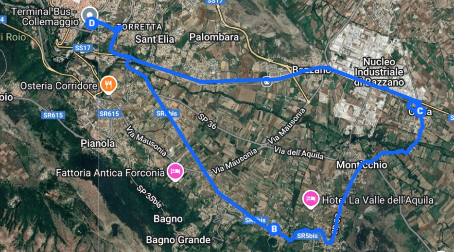

Figura 20. Possibile percorso della linea D, circolare a doppio senso di
percorrenza che costituisce la dorsale del quadrante Sud-Est dell’area
suburbana.

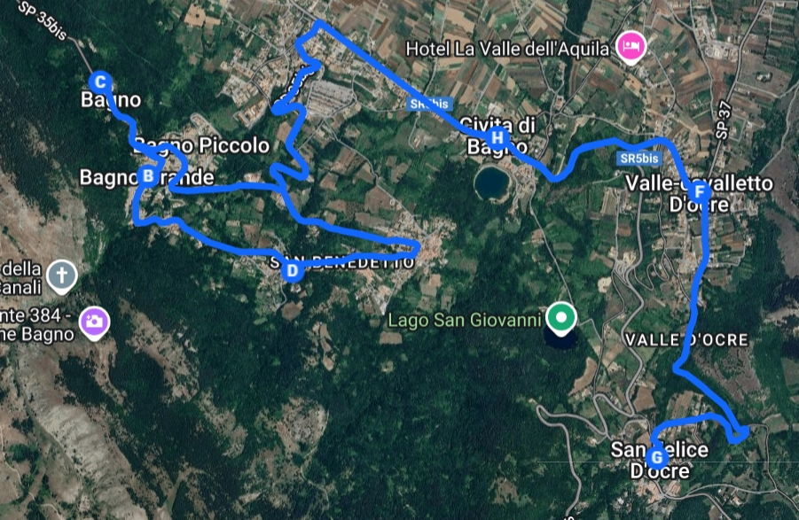

Figura 21. Idea progettuale navetta N10, che si innesta sulla linea D a
Civita Di Bagno e che serve alternativamente Bagno e frazioni e le
frazioni di Ocre.

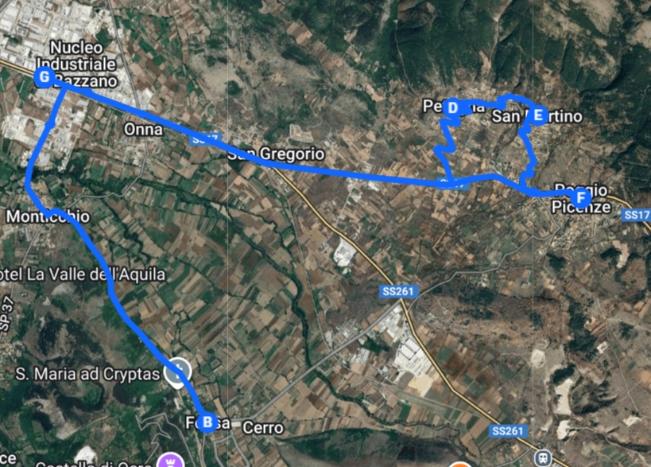

Figura 22. Idea progettuale della navetta N16, che si innesta alle linee
C e D alla Stazione di Paganica e serve alternativamente Fossa e
Picenze.

#### Pianola, Roio (linee AMA attuali 11, 11A)

Il quadrante Sud dell’area suburbana è servito attualmente dalle linee
11 (Figura 23) e 11A (Figura 24). La prima ha come terminali il Terminal
di Collemaggio e L’Aquilone e attraversa tutte le frazioni di Roio,
effettuando anche una deviazione per il Polo universitario di Ingegneria
a Monteluco, con circa 11 corse A/R giornaliere. La seconda collega in
modo più frequente il Terminal con il Polo di Ingegneria, con 18 corse
A/R al giorno.

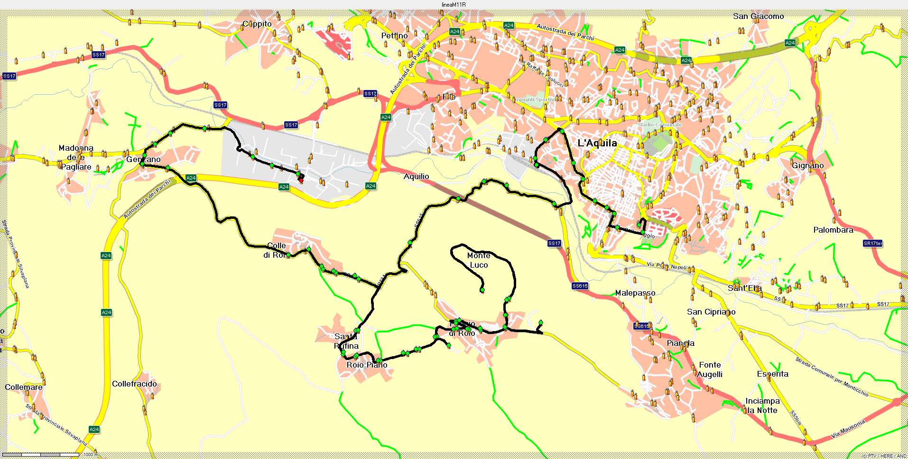

Figura 23. Percorso dell’attuale linea AMA 11, indicato con la linea
nera. In giallo le principali strade.

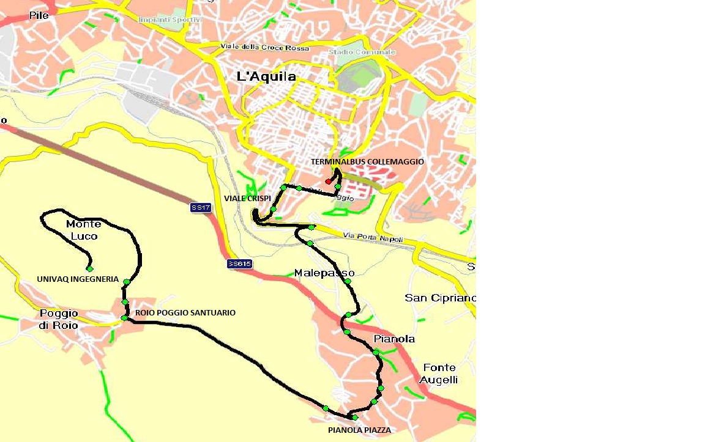

Figura 24. Percorso dell’attuale linea AMA 11A, indicato con la linea
nera. In giallo le principali strade.

Il percorso della **linea 11** appare davvero molto lungo ed
inefficiente. Una possibile idea potrebbe essere quella di intercettare
la linea 11A presso la piazza di **Poggio di** **Roio e fare da spola
solo tra quest’ultimo e L’Aquilone**, in modo da incrementare la
frequenza. La linea 11A garantirebbe il collegamento col centro storico
e con il Polo universitario. Potrebbe essere nominata **navetta N11**.

La **linea 11A** ricopre un’importanza particolare per la presenza del
Polo Universitario molto frequentato e per l’attraversamento di Pianola
e altre zone comunque abitate e suscettibili di sviluppo. Essa potrebbe
**diventare una linea E** (Figura 25) come **dorsale principale del
quadrante suburbano Sud**. Il percorso potrebbe essere leggermente
modificato, in modo da passare vicino al quartiere Bellavista e
limitrofi, più densamente abitati rispetto all’attuale tratto di
congiunzione con la Via Mausonia.

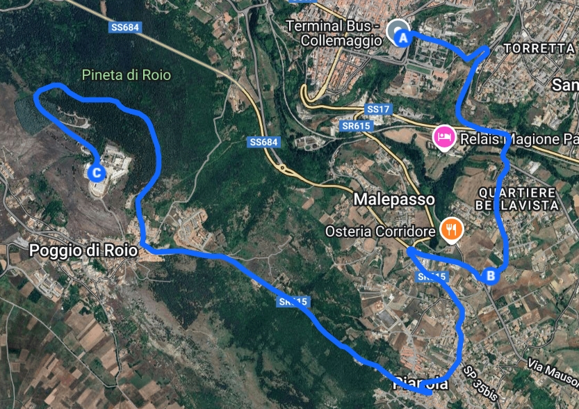

Figura 25. Idea progettuale della linea E, dorsale del quadrante
suburbano Sud.

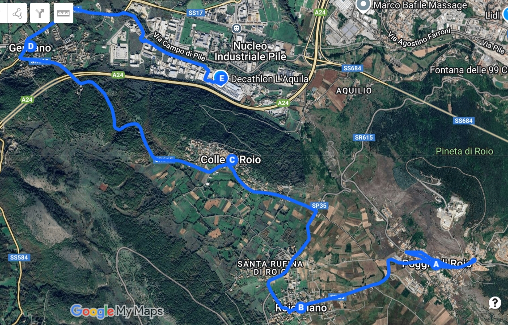

Figura 26. Idea progettuale della navetta N11, che si innesta nella
linea A all’Aquilone e nella linea E a Poggio di Roio, attraversando le
frazioni di Roio.

#### Sassa (linee AMA attuali 12, 12A)

Il quadrante Sud-Ovest di Sassa viene attualmente servito dalle linee 12
(Figura 27) e 12A (Figura 28). Entrambe le linee collegano il Terminal
di Collemaggio con Pagliare di Sassa e Civitatomassa, per poi diramarsi
l’una in direzione Poggio S. Maria-Prata, l’altra verso Foce di Sassa.
Il servizio è concepito per essere prevalentemente scolastico, in quanto
al di fuori di questo vengono effettuate pochissime corse.

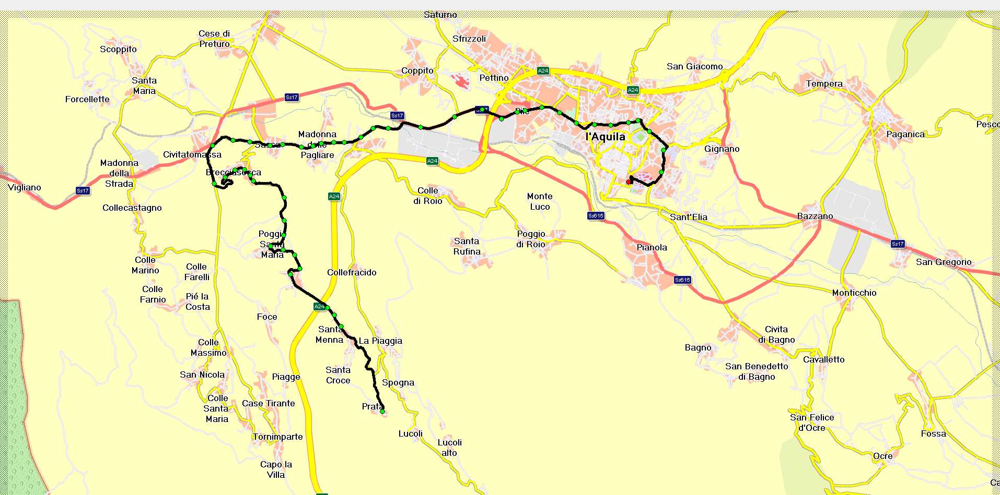

Figura 27. Percorso dell’attuale linea AMA 12, indicato con la linea
nera. In giallo le principali strade.

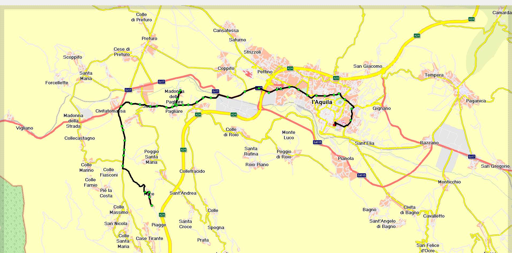

Figura 28. Percorso dell’attuale linea AMA 12A, indicato con la linea
nera. In giallo le principali strade.

Sul modello delle navette suburbane proposte per le altre frazioni,
anche qui appare logico istituire una **navetta N12** (Figura 29) che si
allacci alla linea A all’Aquilone e che abbia come terminale
alternativamente Prata e Foce. Il percorso è comunque molto lungo, ma
permette una maggiore efficienza e frequenza rispetto alle attuali
linee.

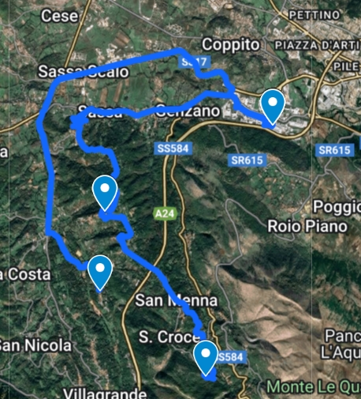

Figura 29. Idea progettuale della navetta N12, che si innesta nella
linea A all’Aquilone e collega le frazioni di Sassa.

#### Coppito, Preturo, Arischia (linee AMA attuali 13, 13A, 14D, 15)

L’area ovest facente capo a Coppito, Preturo e frazioni è servita
attualmente dalle linee 13 e 14 (Figura 30). La linea 13 è concepita
come una navetta con cambio presso il Polo universitario di Coppito, per
poi servire Coppito, Preturo e alcune frazioni di quest’ultimo. La 14D è
invece concepita come una circolare che transita per Polo universitario
Coppito, Coppito, Preturo, Cese, L’Aquilone e torna al Polo di Coppito.
La linea 15 collega direttamente il Terminal di Collemaggio con la
frazione di Arischia.

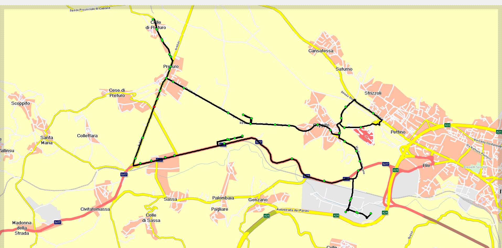

Figura 30. Percorso dell’attuale linea AMA 14D, indicato con la linea
nera. In giallo le principali strade.

La linea 14D attuale si presta a fungere da dorsale del quadrante
suburbano Nord-Est e potrebbe essere quindi configurata come **linea F**
della rete principale a doppia direzione di marcia.

Le linee 13 e 15 potrebbero invece essere unite in una sola linea, la
**navetta N13/N15**, che avrebbe come terminali Menzano e Arischia,
transitando per Preturo e il Polo Universitario di Coppito, per il
raccordo con le linee A e F.

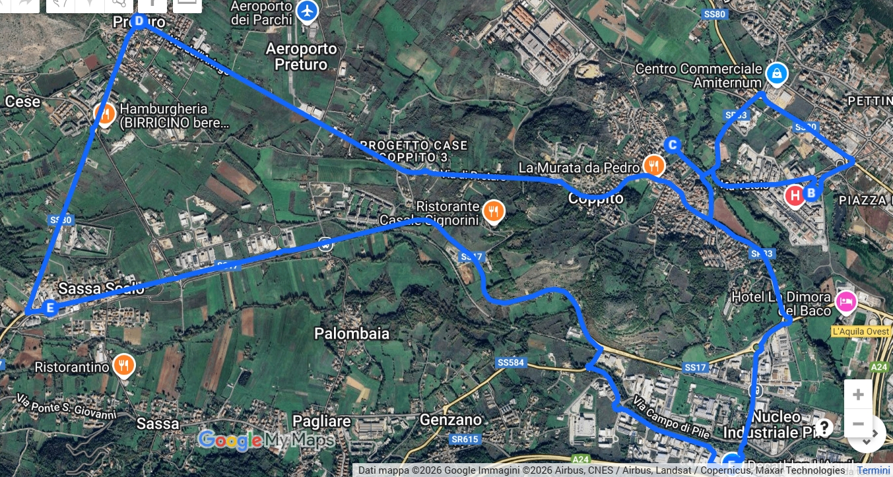

Figura 31. Idea progettuale della linea F, circolare a doppio senso di
percorrenza del quadrante Nord-Ovest dell’area suburbana.

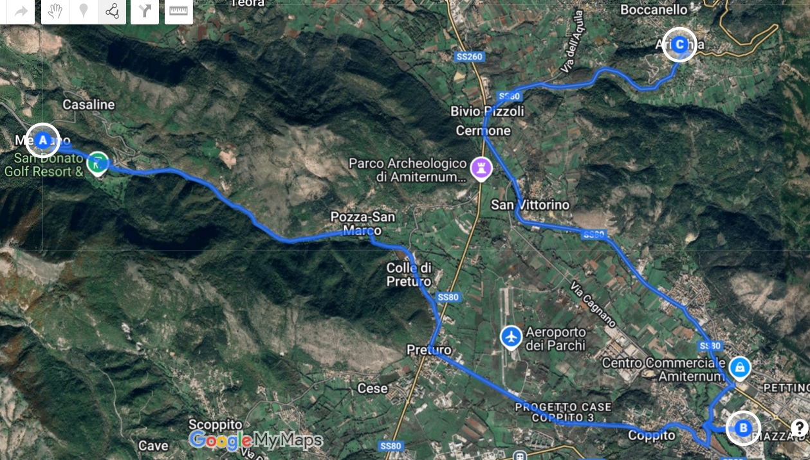

Figura 32. Idea progettuale della navetta N13/N15, che si innesta nella
linea A presso il Polo di Coppito e nella linea F anche a Preturo,
collegando alternativamente le frazioni di Preturo e Arischia.

### Navette

Tutte le **linee a carattere fortemente locale, utilizzabili anche con
autobus di piccole dimensioni**, ad esempio quelle dedicate alla
circolazione interna di un’area relativamente circoscritta oppure al
collegamento di uno specifico quartiere con un polo attrattore,
potrebbero essere denominate navette e **identificate con la lettera N
seguita da un numero**. Nella sezione precedente abbiamo già proposto
una nuova nomenclatura per le linee afferenti alle dorsali principali,
coerente con questo principio.

#### Centro storico (linee AMA attuali CENTRO, 17, 18)

Attualmente il centro storico è servito da una navetta che ha
l’intenzione di agevolare lo spostamento tra il Terminal di Collemaggio
e l’interno del centro storico, soprattutto pensando a chi parcheggia in
quella struttura. Le navette 17/18 offrono un servizio di trasporto
molto specifico che collega Piazzale Cencioni con la Corte dei Conti,
che si trova in zona Viale Duca degli Abruzzi.

Andando a fare una mappatura delle **principali grandi aree di
parcheggio limitrofe al centro storico**, possiamo vedere che la **linea
A** di questa proposta servirebbe, con una **frequenza praticamente
doppia dell’attuale navetta** centro (alternativamente verso la Fontana
Luminosa e la Villa Comunale) chi parcheggia al **Terminal di
Collemaggio, nell’area di Villa Gioia, della Stazione FS, del nuovo
parcheggio della ex Caserma Rossi** (che così non necessiterebbe di
navetta apposita, come anche proposto in passato da Urban Center
L’Aquila), mentre la **linea B e la navetta N8** collegherebbero ad
**alta frequenza tutto il quartiere del Torrione con la Fontana
Luminosa**. La **navetta N5** fornirebbe un ulteriore collegamento con
la Fontana Luminosa.

Pertanto il ruolo di una navetta del centro storico, in linea con quanto
già precedentemente proposto da Urban Center L’Aquila e che verrebbe
nominata **navetta N1**, sarebbe principalmente quello di **facilitare
l’attraversamento trasversale nel cuore del centro**, più che servire i
parcheggi limitrofi che verrebbero serviti dalle linee principali. A tal
fine, considerando la prossima riapertura del **Ponte Belvedere**, un
percorso chiuso che si può immaginare è il seguente:

- Piazza Duomo, Via XX Settembre, Via Fontesecco, Piazza Palazzo, S.
  Bernardino, Fontana Luminosa, Viale Duca degli Abruzzi, Ponte
  Belvedere, Via XX Settembre, Piazza Duomo

Per essere appetibile, il servizio dovrebbe avere una **frequenza di
circa 10 minuti**, perché dovrebbe favorire spostamenti rapidi dentro al
centro, senza necessità di spostarsi con altri mezzi. Una frequenza di
20 minuti sarebbe utile praticamente solo a fini turistici.

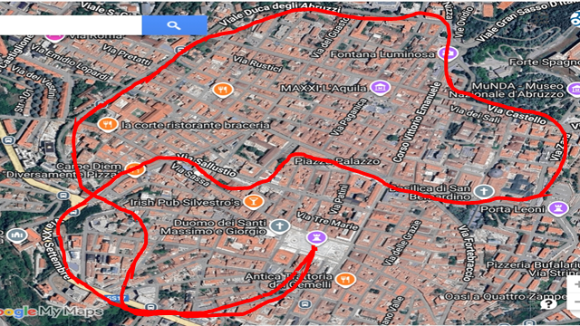

Figura 33. Una idea progettuale per la navetta N1 a servizio del centro
storico, dedicata all’attraversamento trasversale, poiché il servizio di
collegamento con tutte le aree di parcheggio limitrofe verrebbero svolte
ad alta frequenza dalle linee A, B e N8.

#### Polo industriale-commerciale Campo di Pile (linea AMA attuale 19)

L’attuale linea 19 (Figura 34) compie un percorso piuttosto tortuoso tra
Terminal di Collemaggio e Ospedale, toccando l’area commerciale di Pile.
L’area in questione verrebbe servita in modo molto più frequente dal
passaggio della linea A proposta. Eventuali integrazioni alla linea
potrebbero avvenire con navette locali qualora se ne rilevasse il
bisogno.

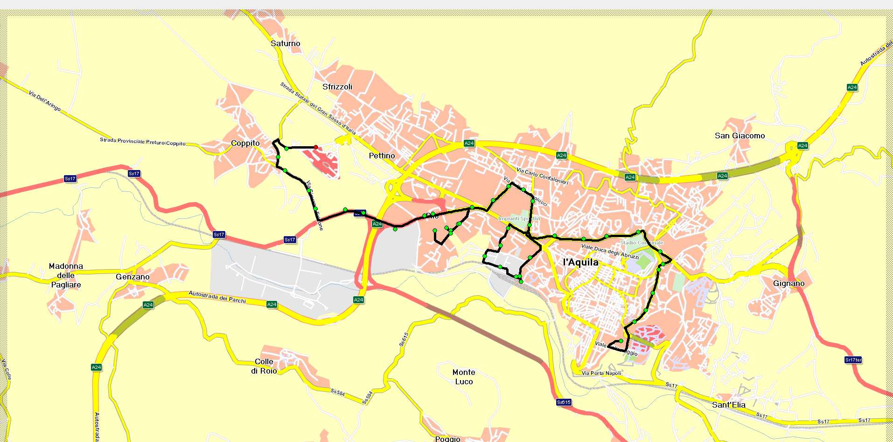

Figura 34. Percorso dell’attuale linea AMA 19, indicato con la linea
nera. In giallo le principali strade.

L’area industriale-commerciale di Campo di Pile è già oggi estesa e
densa a sufficienza da probabilmente giustificare una navetta apposita.
Un’idea potrebbe essere una **navetta N2** che colleghi tra loro i
principali attrattori dell’area, come ad esempio in Figura 35.

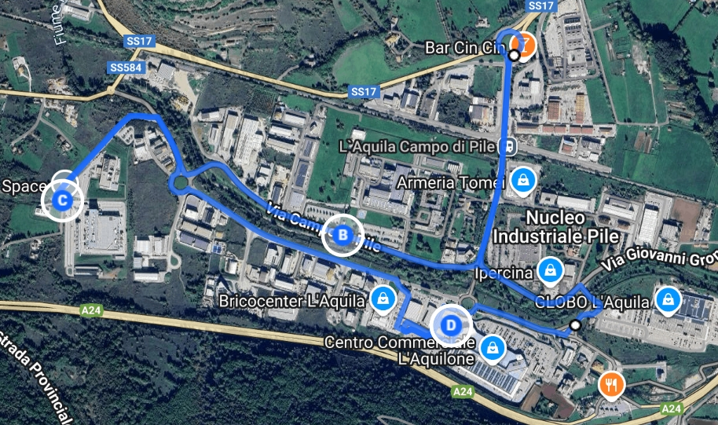

Figura 35. Idea progettuale della navetta N2, utile a collegare tra loro
attrattori e collegamenti principali dell’area industriale e commerciale
di Campo di Pile.

### Bus notturni

Probabilmente non c’è alcuna necessità di rinominare e cambiare i
percorsi delle linee notturne: sarebbe sufficiente mantenere la stessa
nomenclatura delle corse diurne, ma esporre cartelli e informazioni
chiare sugli orari di passaggio nelle ore notturne.

### Trasporto scolastico e universitario

Considerata la specificità dell’utenza e degli orari, sarebbe opportuno
**separare le corse dedicate alle esigenze aggiuntive del trasporto
scolastico** dalle altre linee. Tali corse dovrebbero avere un **ruolo
esclusivamente integrativo rispetto alle linee principali**, come quelle
qui proposte, intervenendo solo nel caso in cui queste non siano
sufficienti a soddisfare le necessità specifiche delle singole scuole.
Un riepilogo dell’attuale organizzazione delle corse per l’ingresso e
l’uscita degli studenti è disponibile sul sito AMA[^7]; senza riprodurne
fedelmente la struttura, si può osservare che, con la proposta in esame:

- **Polo scolastico di Colle Sapone**: servito dalle linee B e N5, a breve distanza pedonale anche da linee
  A, C e N8.

- **Polo scolastico di Via da Vinci**: servito in
  modo frequente da linea B e a breve distanza pedonale da linea A.

- **Istituto Da Vinci - Colecchi e scuola media Patini**: serviti da linea B.
  
- **Scuola media Mazzini**: vicina a Linea A, potrebbe essere opportuna una navetta di raccordo
  ad esempio al Tecnopolo o Centi Colella.

- **Scuola media Carducci**: vicina a linee B ed N5, potrebbe essere opportuna una navetta di raccordo
  in zona Colle Sapone o Torrione.

- **Scuola media Sassa**: servita dalla linea N12.

- **Scuola media Pianola**: servita da linea E.

- **Scuola media Paganica**: servita da linea C.

Per le **scuole medie**, più in generale, considerata anche l’età degli
utenti, appare probabilmente più opportuno prevedere un servizio di
trasporto dedicato, estendendo lo **Scuolabus** della scuola primaria
anche alla scuola secondaria di primo grado.

**In caso l’estensione del servizio di Scuolabus non fosse praticabile,
l’attuale proposta andrebbe a risolvere già gran parte dei problemi**,
poiché offre una visione complessiva di rete degli spostamenti urbani
per tutti gli scopi (scolastici, lavorativi, a servizio di parcheggi di
scambio, pendolari, accesso al centro storico, ecc.), il cui limite a
frequenze di passaggio e fasce orarie coperte è determinato dalle
attuali risorse operative di AMA (autisti, mezzi, chilometri), così come
sintetizzato nella sezione 3 e relativa Tabella 1 (totale 2.700.000 km/anno).
Le criticità residue
appaiono soltanto per i plessi delle scuole medie di Mazzini e Pianola:
un servizio specifico per questi plessi appare perseguibile, in quanto
la presente proposta lascia un margine di 400.000 km/anno per estensioni
e servizi specifici con le attuali risorse.

Per quanto riguarda il **trasporto universitario**, i **tre Poli di
Coppito, Centro e Roio** verrebbero collegati in modo continuo e
frequente dalle **linee A, B, E**, andando a risolvere le criticità di
frequenza irregolare spesso esternate dagli studenti. Inoltre, tutti
Poli sarebbero **connessi in rete con tutto il resto del territorio**
(così come tutte le aree in generale) per consentire la **residenzialità
studentesca** anche su aree oggi poco utilizzabili per questa finalità.

### Nomenclatura e informazioni su linee e servizio in tempo reale

Un modello efficace è quello della **grafica usata per le linee
metropolitane** e il trasporto pubblico in generale nelle maggiori città
italiane ed europee. Le mappe estese consistono in **percorsi stilizzati
sulla piantina della città**, con indicate le **fermate e i punti di
interesse principali**, per dare una visione articolata e “direzionale”
delle linee: servono soprattutto per decidere quali linee utilizzare per
una specifica destinazione. A titolo di esempio riportiamo quella di
Milano in Figura 36. Queste mappe sono utili per i siti web e per essere
apposte nelle fermate o in punti nodali della città, in formato grande e
leggibile, nonché sui dépliant turistici.

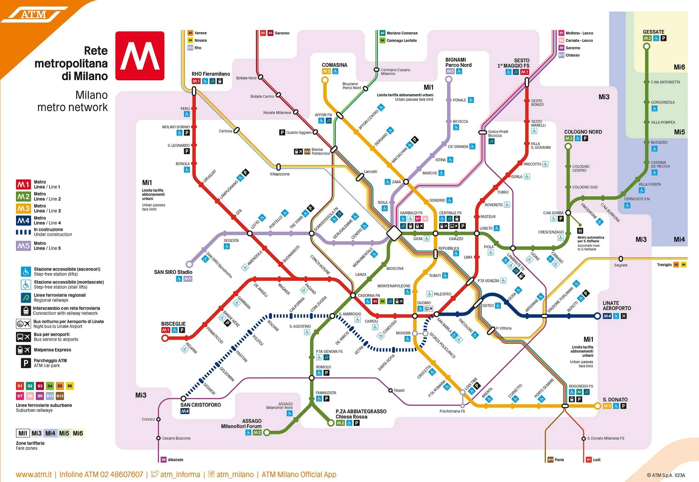

Figura 36. Esempio di mappa stilizzata di linee metropolitane della
città di Milano.

A bordo dei mezzi e apposti nelle fermate è utile invece uno **schema
lineare semplificato della singola linea**, sempre secondo il modello
largamente utilizzato a bordo dei mezzi pubblici di grandi città, che
favorisce una lettura veloce della sequenza delle fermate, soprattutto a
bordo dei mezzi: serve per decidere “al volo” dove scendere. Una
proposta di massima dell’ipotetica “LINEA A” presentata in questa sede è
riportata in Figura 37.

Le fermate principali sono disposte semplicemente in linea sequenziale,
in modo che facilmente si possano individuare a bordo del mezzo le
fermate successive: questi pannelli sono infatti di solito posti al di
sopra delle porte di accesso all’interno del veicolo, grandi e ben
leggibili. Se in corrispondenza delle fermate ci sono **luoghi di
rilevante interesse pubblico (es. ospedali, università, forze
dell’ordine, parcheggi, ecc.)** si possono aggiungere dei simboli
convenzionali accanto al nome della fermata. Nella parte sottostante la
barra delle fermate si indicano le stazioni in cui si possono effettuare
i **cambi con altre linee metropolitane o con altri mezzi extraurbani**.

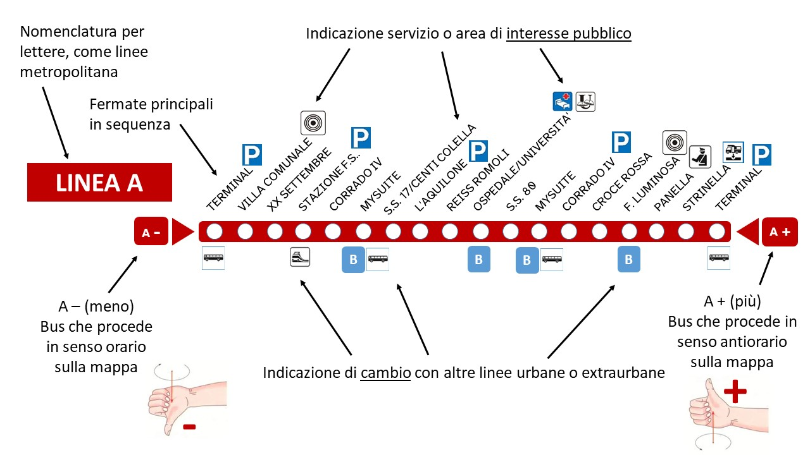

Figura 37. Esempio di rappresentazione grafica lineare degli itinerari
dei bus a bordo dei mezzi, di solito poste in alto sopra le porte di
entrata e uscita all’interno del mezzo, e nelle informazioni su web e
nei pannelli. Indicate le fermate principali, i luoghi di interesse
pubblico principali e le stazioni di cambio con altre linee
metropolitane o extraurbane (bus, treno, ecc.) o con altri mezzi.
L’indicazione del senso di percorrenza della linea è indicata con più
(senso antiorario o avvitare) o meno (senso orario o svitare), secondo
la convenzione della mano destra per la rotazione.

Per **indicare il senso di percorrenza della linea**, che come proposto
avviene contemporaneamente con due bus in senso orario e antiorario, si
potrebbe adottare la convenzione internazionale che indica il senso di
rotazione in generale, ovvero quella che segue la cosiddetta “regola
della mano destra” o “vite destrogira”: il “più” indica il verso in cui
il pollice è in su e le dita indicano il senso di rotazione antiorario,
il “meno” l’opposto, ovvero pollice in giù e dita che indicano rotazione
oraria.

In alternativa, si potrebbe anche utilizzare l’indicazione
Destra/Sinistra per il senso di rotazione, come fatto attualmente per la
linea 6S/D.

Anche il suggerimento di utilizzare le lettere al posto dei numeri per
identificare le linee fornisce un maggiore senso di ossatura
metropolitana di riferimento, che è l’intento di fondo della presente
proposta di revisione.

La stessa cura deve essere riservata a **ogni singola fermata**, che
deve essere **accessibile, sicura, ombreggiata e sufficientemente
spaziosa, nonché posta nelle posizioni più favorevoli** per essere
raggiunta a piedi dalle aree residenziali e dai luoghi di interesse
pubblico limitrofi. Desiderabile anche la presenza di **display
elettronici che aggiornino in tempo reale la stima dei minuti mancanti**
**al passaggio delle corse più prossime**.

Tutti questi sono suggerimenti finalizzati a migliorare la leggibilità,
facilità e velocità di accesso alle informazioni basilari su linee e
fermate, utili nell’utilizzo routinario quotidiano sia di passeggeri
abituali che estemporanei, in **un’ottica di servizi integrati per la
mobilità che permettano di risolvere i problemi legati all’eccessiva
dipendenza dall’auto privata**.

## Conclusioni

### Riepilogo e stima conteggio chilometrico della proposta

La proposta di riorganizzazione delle linee di trasporto pubblico urbano
nel Comune dell’Aquila illustrata in queste pagine consiste nella
suddivisione in **6 linee principali** a doppio senso di circolazione,
denominate con le lettere dalla A alla F, più **11 navette locali** che
si diramano dalle direttrici principali per raggiungere con la stessa
capillarità attuale l’area urbana. Le linee così organizzate
**permetterebbero di incrementare in tutte le zone la frequenza di
servizio e soprattutto di renderlo regolare e prevedibile nel tempo**.
Ciò renderebbe più efficiente l’uso delle attuali risorse, più fruibile
il servizio di trasporto pubblico da un maggior numero di utenti per
tutti gli scopi e dovrebbe anche facilitare la gestione operativa del
servizio da parte dell’AMA stessa.

La mappa delle 6 linee principali è riportata in Figura 38, mentre il
riepilogo complessivo di tutte le linee proposte è riportato in
Tabella 1. Il dettaglio con le navette è diviso nei due quadranti Est
(Figura 39) e Ovest (Figura 40).

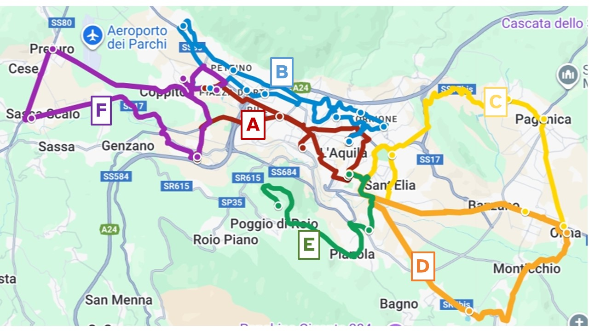

Figura 38. Mappa delle sei linee principali della proposta (linee A-F),
che permettono di connettere in modo continuo e frequente l’area urbana
più densamente popolata attraverso direttrici e poli attrattori
principali.

La stima del conteggio chilometrico complessivo annuale della proposta,
con un servizio **erogato tutti i giorni dell’anno** (considerando
frequenze dimezzate sabato e domenica) **dalle 7:00 alle 21:00** (14 ore
di servizio al giorno), ammonta a **circa 2.700.000 di km in totale**.
Questo **lascia liberi circa 700.000 km/anno** di operatività per
coprire i residui fabbisogni supplementari, come ad esempio particolari
esigenze del trasporto scolastico o corse notturne. Sempre dal punto di
vista operativo, la rete proposta richiederebbe **ogni ora l’impiego di
28 mezzi**[^8], ovvero di autisti. Il numero complessivo di corse
giornaliere passerebbe dalle 515 attuali a circa 500. La proposta sembra
pertanto essere largamente entro l’attuale disponibilità operativa
dell’AMA, tant’è vero che dal conto preliminare delle corse al giorno e
dei chilometri percorsi in un anno **si andrebbe a risparmiare pur
erogando un servizio molto più efficiente ed utilizzabile**.

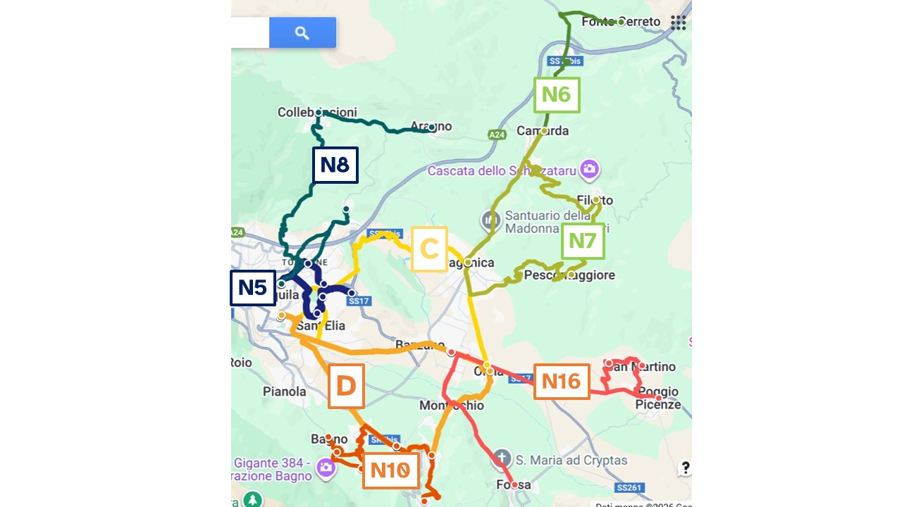

Figura 39. Mappa complessiva delle linee nel quadrante Est.

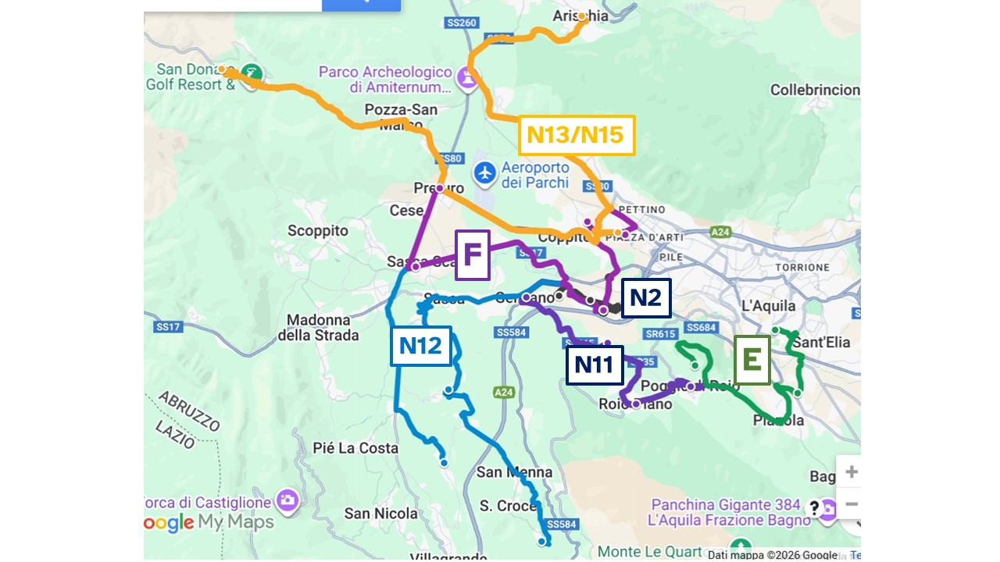

Figura 40. Mappa complessiva delle linee nel quadrante Ovest.

Tabella 1. Lista delle linee proposte, link ai percorsi su MyMaps e
stima del conteggio chilometrico giornaliero e annuale. I giorni di
servizio annuali (d) sono calcolati considerando frequenze dimezzate il
sabato e la domenica e quindi calcolando i giorni interi effettivi.
L’orario di servizio giornaliero ipotizzato è 7:00-21:00,
approssimativamente come quello attuale. Nelle ultime due colonne sono
riportate le linee attuali che verrebbero accorpate o trasformate, con
l’attuale conteggio di corse giornaliere effettuate.

| **Linea**   | **Zona**                                    | **MyMaps**                                                                                | **Lunghezza percorso (km)** | **Frequenza percorso (min.)** | **Numero di direzioni** | **Giorni/anno** | **Ore/giorno** | **Chilometri annuali** | **Corse/giorno** | **Linee attuali** | **Corse/giorno attuali** |
|-------------|---------------------------------------------|-------------------------------------------------------------------------------------------|-----------------------------|-------------------------------|-------------------------|-----------------|----------------|------------------------|------------------|-------------------|--------------------------|
| **A**       | Circolare principale area urbana densa      | <https://www.google.com/maps/d/u/0/edit?mid=11YGAPghC5MACeNGmj1X4qGPWbQkm-7o&usp=sharing> | 20                          | 20                            | 2                       | 310             | 14             | 520.800                | 84               | A/B, 2, 2U        | 102                      |
| **B**       | Circolare secondaria area urbana densa Nord | <https://www.google.com/maps/d/u/0/edit?mid=1wfGigFAiuIVPzQLKPOrhhgMnHBy2s1o&usp=sharing> | 20                          | 30                            | 2                       | 310             | 14             | 347.200                | 56               | 1, 3              | 120                      |
| **C**       | Circolare est Paganica                      | <https://www.google.com/maps/d/u/0/edit?mid=11-30BCV7QAoK_YVmtP3gc2XmYBxsaSU&usp=sharing> | 21                          | 40                            | 2                       | 310             | 14             | 273.420                | 42               | 6S-6D             | 59                       |
| **D**       | Circolare est Bagno                         | <https://www.google.com/maps/d/u/0/edit?mid=1BRhjj5PjQVruVfKsRrqV2O3LcXo-N5w&usp=sharing> | 19                          | 60                            | 2                       | 310             | 14             | 164.920                | 28               | 10                | 16                       |
| **E**       | Ingegneria Roio                             | <https://www.google.com/maps/d/u/0/edit?mid=1h13wPJ9GELg3gFJefrZYuXbJCxo9vuc&usp=sharing> | 18                          | 25                            | 1                       | 310             | 14             | 187.488                | 34               | 11A               | 37                       |
| **F**       | Circolare Coppito-Preturo                   | <https://www.google.com/maps/d/u/0/edit?mid=1EsWahsYO8-rlwVbHHlhpx89fqk1p-S4&usp=sharing> | 20                          | 60                            | 2                       | 310             | 14             | 173.600                | 28               | 14D, 15           | 43                       |
| **N1**      | Centro Storico                              |                                                                                           | 4                           | 10                            | 1                       | 310             | 14             | 104.160                | 84               | Centro            | 40                       |
| **N2**      | Campo di Pile                               | <https://www.google.com/maps/d/u/0/edit?mid=1B-XjeDFZgr5XN9iFOsUlbniYpetBX6I&usp=sharing> | 6                           | 30                            | 1                       | 310             | 14             | 52.080                 | 28               | \-                | \-                       |
| **N5**      | Torretta-Gignano                            | <https://www.google.com/maps/d/u/0/edit?mid=1rsRZFWz9C-qNcsVSqUR_0Vl3JUM4uBg&usp=sharing> | 7                           | 30                            | 1                       | 310             | 14             | 60.760                 | 28               | 5                 | 18                       |
| **N6**      | Paganica-Fonte Cerreto                      | <https://www.google.com/maps/d/u/0/edit?mid=1odkcdU33t-ld2bTZmueti7t6VHYGY_Q&usp=sharing> | 22                          | 60                            | 1                       | 310             | 14             | 95.480                 | 14               | M6                | 18                       |
| **N7**      | Paganica-Camarda-Filetto-Pescomaggiore      | <https://www.google.com/maps/d/u/0/edit?mid=1ZPZ5CP2q_-EP7D8Spuf5qC_QYldmhCY&usp=sharing> | 21                          | 60                            | 1                       | 310             | 14             | 91.140                 | 14               | 7                 | 8                        |
| **N8**      | S. Giacomo-Collebrincioni-Aragno            | <https://www.google.com/maps/d/u/0/edit?mid=1gQbnrIk1DkkobSlHBPAroO_b_ZOOwp0&usp=sharing> | 32                          | 60                            | 1                       | 310             | 14             | 138.880                | 14               | 8, 9              | 10                       |
| **N10**     | Bagno-Ocre                                  | <https://www.google.com/maps/d/u/0/edit?mid=1RFZF1XzSpAme8Q7ttCOWq-L1Au4TZsY&usp=sharing> | 18                          | 60                            | 1                       | 310             | 14             | 78.120                 | 14               | \-                | \-                       |
| **N11**     | Roio                                        | <https://www.google.com/maps/d/u/0/edit?mid=1W-8Y5HZqEznnJo6MbPbv3lnVYdU3Rv0&usp=sharing> | 24                          | 60                            | 1                       | 310             | 14             | 104.160                | 14               | 11                | 14                       |
| **N12**     | Sassa                                       | <https://www.google.com/maps/d/u/0/edit?mid=1hPYkpGsDM-H_WyvJugJjM6Q8aNnps_Q&usp=sharing> | 56                          | 90                            | 1                       | 310             | 14             | 162.027                | 9                | 12, 12A, M12X     | 12                       |
| **N13/N15** | Menzano-Arischia                            | <https://www.google.com/maps/d/u/0/edit?mid=1ALnwQ8f4Pw1BAGyWdJoHKRsSwlQbG5A&usp=sharing> | 50                          | 90                            | 1                       | 310             | 14             | 144.667                | 9                | 13                | 18                       |
| **N16**     | Fossa-Picenze                               | <https://www.google.com/maps/d/u/0/edit?mid=1AHwhtZuknhTlsaEc_VSMKgU6ok02ZwY&usp=sharing> | 28                          | 60                            | 1                       | 310             | 14             | 121.520                | 14               | 16, 16A           | 15                       |
| **TOTALE**  |                                             |                                                                                           |                             |                               |                         |                 |                | 2.698.901              | 500              |                   | 515                      |

### Sviluppi futuri

La proposta, finora maturata e presentata in queste pagine, inizia
volutamente con il servizio di trasporto pubblico, perché questo è
considerato il presupposto, lo scheletro portante, di qualsiasi
iniziativa di rigenerazione urbana. Il necessario sviluppo del lavoro
riguarda aspetti legati alla viabilità, in particolare dal punto di
vista pedonale e ciclabile, e la gestione dello spazio pubblico adibito
a parcheggio. Nelle proposte preliminari illustrate nel documento, i
principi ispiratori sono già tuttavia delineati.

Lo spazio pubblico, per restare tale e fornire benefici socio-economici
e ambientali diffusi, deve necessariamente riflettere l’interesse
pubblico della comunità che lo vive, a iniziare dal come essa vi si
sposta attraverso. Una mobilità troppo sbilanciata sul trasporto
privato, com’è ora, non può che creare distorsioni nel suo utilizzo,
cosa che penalizza la qualità e fruibilità dei luoghi, intralciando il
trasporto collettivo e sacrificando la percorribilità di strade e piazze
a piedi, in bici o con ausili alla deambulazione, diminuendo così la
qualità della vita e l’autonomia delle persone.

Tutti i percorsi interessati dal trasporto pubblico identificano le
arterie principali del tessuto urbano: come tali, devono essere
progettate e mantenute in modo da garantire sicurezza, comfort e
continuità anche con percorsi pedonali e ciclabili adiacenti ad essi.
L’uso del suolo pubblico per parcheggio di mezzi privati deve essere
gratuito solo in casi limitati, ad esempio per i residenti della zona.
In aree ad alta frequentazione esso deve essere necessariamente a
pagamento, in modo commisurato al tempo di utilizzo, alla distanza
dall’area di interesse e alla disponibilità reale di spazio e di
alternative di trasporto.

Possibilmente, le superfici adibite a parcheggio devono essere
deimpermiabilizzate e sfruttate anche per la produzione di energia
fotovoltaica. Ovunque possibile, le aree di parcheggio vanno ridotte a
favore di verde pubblico e altri spazi fruibili liberamente. I ricavi
dei parcheggi devono essere reimpiegati per finanziare e migliorare le
alternative all’automobile, ovvero trasporto pubblico, pedonalità e
ciclabilità delle strade, non solo attraverso nuove infrastrutture e
nuovi servizi, ma anche attraverso un’ampia e analitica opera di
educazione e informazione.

## Appendice: Storia e versioni del documento

- Tra fine 2024 ed inizio 2025, le idee embrionali della proposta sono
  maturate all’interno dell’associazione FIAB L’Aquila, che ha iniziato
  a illustrarla e discuterla con diverse associazioni e realtà
  cittadine.

- Nel periodo aprile-giugno 2025 le idee sul trasporto pubblico sono
  state sviluppate durante gli incontri settimanali di “Spazio Comune”,
  promossi e ospitati dal circolo “L’Aquila centro” del Partito
  Democratico.

- A seguito di un primo incontro con il Presidente AMA e con le
  rappresentanze sindacali AMA, una prima versione del documento sul
  trasporto pubblico è stata finalizzata il 3 luglio 2025.

- Aggiornamenti successivi: 31 luglio (conteggio chilometrico linee), 27
  agosto (appendice su grafica e nomenclatura), 2 settembre (mappa nodi
  principali), 8 settembre (linea B unica)

- Settembre 2025: il documento è stato inviato via PEC al Settore
  Mobilità Sostenibile del Comune dell’Aquila, all’AMA e depositato
  presso l’Urban Center L’Aquila durante la Settimana Europea della
  Mobilità sostenibile.

- Da ottobre 2025: lo sviluppo della proposta prosegue all’interno delle
  riunioni del gruppo di lavoro sulla mobilità dell’Urban Center
  L’Aquila, sviluppando le idee sul trasporto pubblico oltre l’area
  urbana densa e quelle sulla revisione della pedonalità e della
  ciclabilità, in modo coordinato tra loro e con i programmi inseriti
  nel PUMS.

- 12 gennaio 2026: prima versione della proposta di riorganizzazione di
  tutta la rete di trasporto pubblico urbano.

- 20 febbraio 2026: ulteriore revisione della proposta all’interno di
  Urban Center L’Aquila.

- 23 marzo 2026: primo incontro di presentazione e discussione della
  proposta con Responsabile Movimento di AMA.

- 27 aprile 2026: ulteriore chiarimento su come il trasporto scolastico
  si inserisce nella proposta complessiva.

- 5 maggio 2026: verso ultimazione prima versione pubblica Urban Center
  L’Aquila, con principi riguardanti pedonalità, ciclabilità e parcheggi
  inseriti nelle conclusioni.

- 25 maggio 2026: sviluppo sezioni su pedonalità, ciclabilità e
  parcheggi, anche integrando passate proposte di Urban Center L’Aquila.

- 29 maggio 2026: ulteriore revisione con correzione di refusi e alcune
  precisazioni.

- 16 giugno 2026: aggiunta copertina e modificato titolo del documento.

- 26 settembre 2026: a seguito di mancato incontro con AMA e Comune
  dell’Aquila, il documento torna a focalizzare principalmente sul
  trasporto pubblico, col fine di rendere pubblica la proposta su una
  piattaforma open.
  
- 9 ottobre 2026: prima versione aperta della proposta pubblicata su GitHub

[^1]: <https://www.pumslaquila.it/> , in particolare il cronoprogramma
    sintetico degli interventi riportato al [TOMO 2, Capitolo 9 “Quadro
    riassuntivo Obiettivi – Strategie –
    Azioni”](https://s3-eu-west-1.amazonaws.com/pumslaquila/Relazione032021/0%20Relazione%20PUMS/Tomo%202/TOMO%202%20cap.%209%20Quadro%20riassuntivo%20Obiettivi%20-%20Strategie%20-%20Azioni_Rev%2003.pdf).

[^2]: <https://www.pumslaquila.it/pgtu/>, in particolare la
    [presentazione del Secondo Rapporto
    Intermedio](https://www.pumslaquila.it/wp-content/uploads/2025/09/PRESENTAZIONE_2_RAPP_INTERMEDIO_23.09.2025.pdf)
    del 23/09/2025.

[^3]: PUMS al [TOMO 2 Cap. 11 Descrizione dello scenario di
    progetto](https://s3-eu-west-1.amazonaws.com/pumslaquila/Relazione032021/0%20Relazione%20PUMS/Tomo%202/TOMO%202%20Cap.%2011%20Descrizione%20dello%20scenario%20di%20progetto%20Rev%2007.pdf),
    in particolare la sezione 11.6.2 “Il progetto Metrobus”.

[^4]: <https://www.pumslaquila.it/mobilita/biciplan/>, in particolare la
    [mappa
    KMZ](https://mega.nz/file/BosWWAZb#NOb7eatIQQ0Yh8uxOnUfGqzWwNwLzywhrBQxyopIoUk).

[^5]: <https://www.pumslaquila.it/mobilita/puls/>, in particolare la
    [Relazione generale
    definitiva](https://www.pumslaquila.it/wp-content/uploads/2025/05/PULS_Relazione-Generale.pdf).

[^6]: <https://www.ama.laquila.it/linee-e-orari/elenco-linee-ama/>

[^7]: Corse scolastiche AMA:
    <https://www.ama.laquila.it/linee-e-orari/elenco-linee-ama/#cat39>

[^8]: Il numero di mezzi è così calcolato: 6 bus/ora per la linea A, 4
    bus/ora per la linea B, 2 bus/ora per ciascuna delle linee C, D, F e
    1 bus/ora per la linea F, quindi in totale 17 bus/ora per le sei
    linee principali. A questi si aggiungono 1 bus/ora per ciascuna
    delle undici navette, quindi in totale 28 bus/ora.
